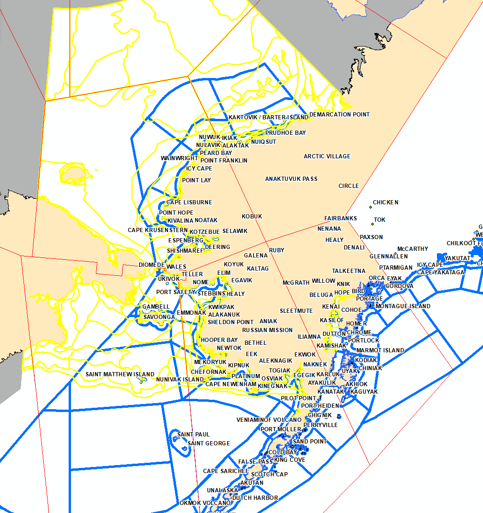

# ArcMAP Script to create NWS ASIP Forecast Text Product
Due to the increase of the number of marine zones as of March 8, 2023, this helps the forecaster with the manual entry of zone names.
The script answers the question "What are the names of the zones that have sea ice within them?"
Find an example of the [text product output](https://tgftp.nws.noaa.gov/data/raw/fz/fzak80.pafc.ice.afc.txt) with human input for the forecast verbage on the NWS Alaska Sea Ice Program webpage.

